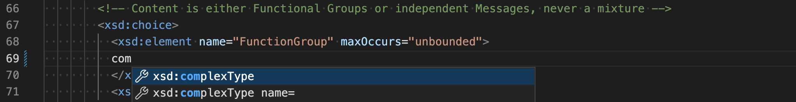
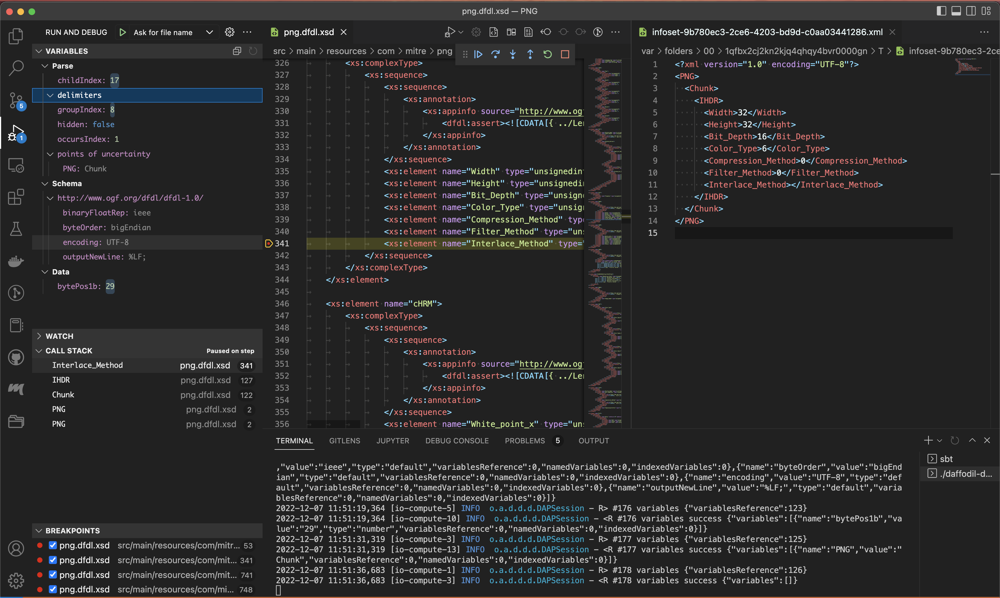
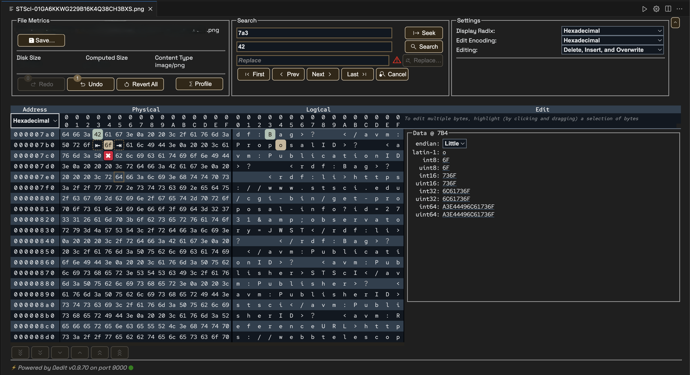
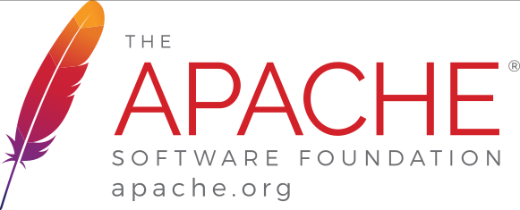

<!--
  Licensed to the Apache Software Foundation (ASF) under one or more
  contributor license agreements.  See the NOTICE file distributed with
  this work for additional information regarding copyright ownership.
  The ASF licenses this file to You under the Apache License, Version 2.0
  (the "License"); you may not use this file except in compliance with
  the License.  You may obtain a copy of the License at

      http://www.apache.org/licenses/LICENSE-2.0

  Unless required by applicable law or agreed to in writing, software
  distributed under the License is distributed on an "AS IS" BASIS,
  WITHOUT WARRANTIES OR CONDITIONS OF ANY KIND, either express or implied.
  See the License for the specific language governing permissions and
  limitations under the License.
-->

# Apache Daffodil™ Extension for Visual Studio Code

The Apache Daffodil™ Extension for Visual Studio Code is an extension to the Microsoft® Visual Studio Code (VS Code) editor, designed for Data Format Description Language<a href="#footnotes">1</a> [(DFDL)](https://daffodil.apache.org/docs/dfdl/) Schema developers. 

DFDL is a data modeling language used to describe file formats. The DFDL language is a subset of eXtensible Markup Language (XML) Schema Definition (XSD). File formats are rich and complex - they require a modeling language to describe them. Developing DFDL Schemas can be challenging, requiring extensive iterative development and testing.

The purpose of the Apache Daffodil™ Extension for Visual Studio Code is to ease the burden on DFDL Schema developers by enabling rapid development of high-quality DFDL Schemas, with syntax highlighting, code completion, data file editing, and debugging of DFDL Schema parsing operations using Apache Daffodil™.

## DFDL Schema Development

The Apache Daffodil™ Extension for Visual Studio Code provides syntax highlighting to enhance the readability and context of the text. It provides instant feedback to developers, indicating that the structure and code are syntactically correct.

The Apache Daffodil™ Extension for Visual Studio Code provides code completion, offering context-aware code segment predictions that can dramatically speed up DFDL Schema development by reducing keyboard input, developer memorization, and typos.

## Daffodil Data Parse Debugger

The Apache Daffodil™ Extension for Visual Studio provides a Daffodil parse debugger, enabling developers to control the execution of Daffodil parse operations. Given a DFDL Schema and a target data file, the developer can step through the execution of parse operations line by line, or until the parse reaches some developer-defined location, known as a breakpoint, in the DFDL Schema or the data being parsed. What is particularly helpful is that the developer can watch the parsed output, known as the “Infoset”, as it is being created by the parser, and watch where the parser is parsing in the data file. This enables the developer to quickly discover and correct DFDL Schema issues, making development and testing cycles more efficient.

## Data Editor

The Apache Daffodil™ Extension for Visual Studio Code provides an integrated data editor tuned specifically for challenging Daffodil use cases. It is designed to support large files, of any type, that are well beyond the limits of the standard text editor in VS Code. The Data Editor enables the editing of single or multiple bytes in various encodings. The Data Editor can seek to file offsets, search and replace byte sequences, profile data, and determine a file's content type. Features of the Data Editor will evolve to address the specific needs of the Daffodil community.

### Data Debugger Integration

The Data Editor component can be configured to run alongside and open the designated file specified by the data debugger. During this operation, whenever the debug session steps to a new byte position or stops at a breakpoint, the data content within the Data Editor will illustrate the byte location.

# Prerequisites

* [Install VS Code, version 1.82.0 or greater](https://code.visualstudio.com/download)
* [Install Java Runtime 8 or greater](https://docs.oracle.com/goldengate/1212/gg-winux/GDRAD/java.htm#BGBFJHAB)
* On Linux, glibc 2.31 or greater is required

# Getting Help

If additional help or guidance on using Apache Daffodil™, Apache Daffodil™ Extension for Visual Studio Code, or DFDL development in general is needed, please engage with the Daffodil user and developer communities on [mailing lists](https://daffodil.apache.org/community/) (https://daffodil.apache.org/community/) and/or review the [list archives](https://lists.apache.org/list.html?users@daffodil.apache.org) (https://lists.apache.org/list.html?users@daffodil.apache.org).

# Community Feedback

Apache Daffodil™ and the Apache Daffodil™ Extension for Visual Studio Code are Apache Software Foundation (ASF) projects, are free open-source software, and are under active development. Feedback and contributions are welcome.

# Additional Resources
* [Apache Daffodil™ Home Page](https://daffodil.apache.org) (https://daffodil.apache.org)
* [Apache Daffodil™ Extension for Visual Studio Code Repository](https://github.com/apache/daffodil-vscode) (https://github.com/apache/daffodil-vscode)
* [Apache Daffodil™ Extension for Visual Studio Code Wiki](https://github.com/apache/daffodil-vscode/wiki) (https://github.com/apache/daffodil-vscode/wiki)
* [Apache Daffodil™ Library Repository](https://github.com/apache/daffodil) (https://github.com/apache/daffodil)

## License

Apache Daffodil™ Extension for Visual Studio Code is licensed under the [Apache License, v2.0].

[Apache License, v2.0]: https://www.apache.org/licenses/LICENSE-2.0
[GitHub Issues]: https://github.com/apache/daffodil-vscode/issues

This product includes the [logback](https://github.com/qos-ch/logback) library, which is available under the Eclipse Public License v1.0.

This product includes the [Java Debug Server for Visual Studio Code](https://github.com/microsoft/java-debug) library, which is available under the Eclipse Public License v1.0.

This product includes the [Xml Schema Object Model](https://github.com/kohsuke/xsom) library, which is licensed under the Common Development and Distribution License Version 1.1.

This product includes the Regular Mono [RedHatFont](https://github.com/RedHatOfficial/RedHatFont) font, which is licensed under the SIL Open Font License, Version 1.1.

This product includes the [space-grotesk](https://github.com/floriankarsten/space-grotesk) font, which is licensed under the SIL Open Font License, Version 1.1.

# Legal

Apache, Apache Feather Logo, Apache Daffodil, Daffodil, and the Apache Daffodil logo are trademarks of The Apache Software Foundation.  Visual Studio Code and VS Code are trademarks of Microsoft® Corporation. All rights reserved.

#### Footnotes

1 Data Format Description Language (DFDL) is a standard from the Open Grid Forum (www.ogf.org), available [here](https://ogf.org/documents/GFD.240.pdf) (https://ogf.org/documents/GFD.240.pdf).

Copyright © 2025 [The Apache Software Foundation](https://www.apache.org/). Licensed under the [Apache License, Version 2.0](https://www.apache.org/licenses/LICENSE-2.0). 
 
Apache, Apache Daffodil, Daffodil, and the Apache Daffodil logo are trademarks of The Apache Software Foundation.
