|

|

|
|:---|---|
|Introduction to the **Apache Daffodil Extension**  for  **Visual Studio Code**  |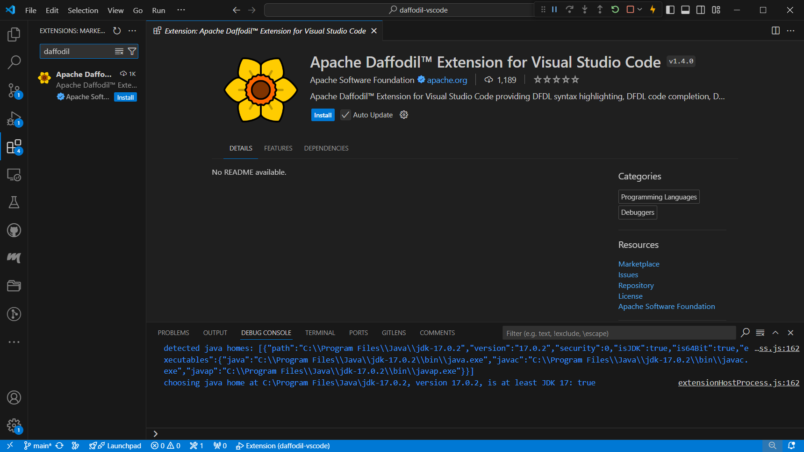|

|

|

|
|:---|---|
|**The Mission: Make Daffodil Coding & Debugging Easier**    The Command Line Interface with existing Daffodil debugging capability is non\-intuitive and difficult to master        |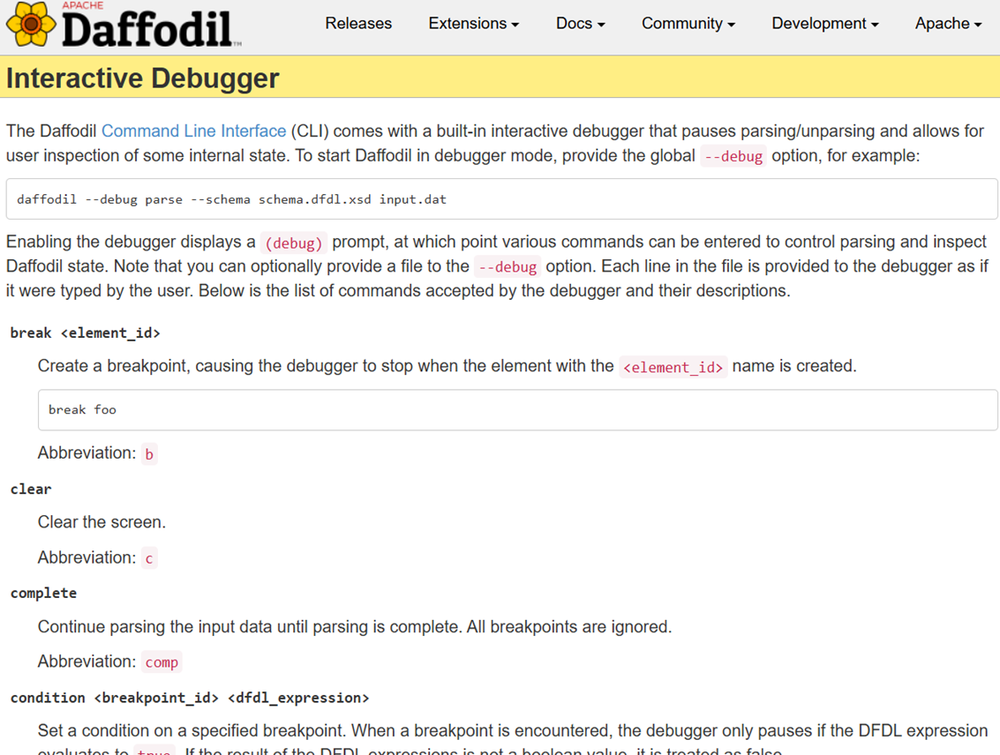|

|

|

|
|:---|---|
|**The Solution: Integrate Daffodil with VS Code** <ul><li>Source Level Debugging</li><li> Breakpoints</li><li>Single Stepping</li><li>Syntax Highlighting</li><li>Context Aware Code Completion Assistance</li><li>Data view & Location Tracking</li><li>Interactive Infoset Viewing</li></ul>|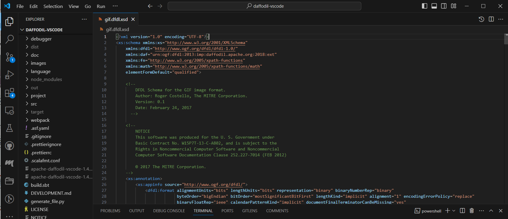|

|

|

|
|:---|---|
|**The How:**      <ul><li>VS Code plug\-in extension</li><li>DAPodil interface server</li><li>Ωedit \& Data Editor</li><li>Apache Daffodil w/ integrated Debugger</li></ul>    |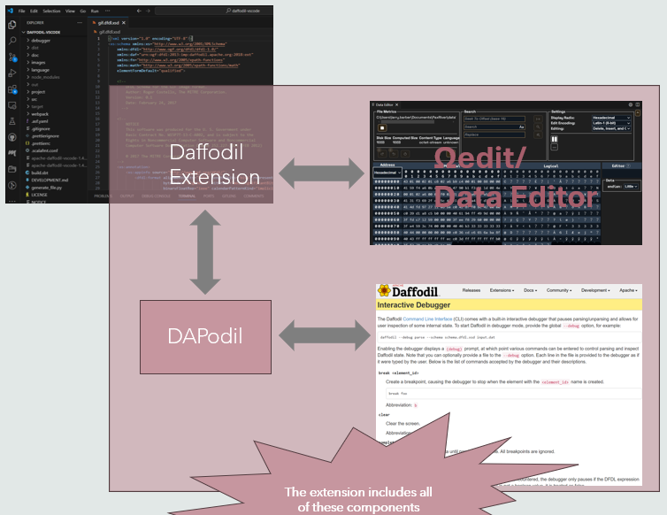|

|

|

|
|:---|:---|
|**The Caveats:**    <ul><li>No new functionality has been added to Daffodil’s integrated debugger</li><li>VS Code simply provides a simpler\, more intuitive user interface</li><li>Not all debugger capabilities are available via VS Code\.</li></ul>|<ul><li>The code being executed within Daffodil is a parser that it constructed based upon the provided schema\.</li><li>There is  ***not***  a one\-to\-one correspondence between the schema structure and that of the parser.  This means that there is  ***not***  a one\-to\-one correspondence between the lines in the schema and what Daffodil executes when the user asks the debugger to “step”.</li><li>There will be instances where the “step” does not result in movement of the indicator showing current location within the schema\.  This is similar to\, but more exaggerated than\, debugging code compiled with optimization enabled\.</li><li>Additionally\, data shown in the infoset may appear in chunks and/or may be removed when the parser backtracks if a parse branch is found to be incorrect\.</li></ul>|

**Don’t worry if you’re new to IDE use and don’t know what any of this means\. We’ll cover it in detail later\.**

|

|

|
|:---|:---|
|**IDE Basics**  Integrated Development Environment A single program that integrates all the steps of software development<ul><li>***Editing***</li><li>Compiling</li><li>Execution</li><li>Debugging</li><li>Version Control</li></ul>|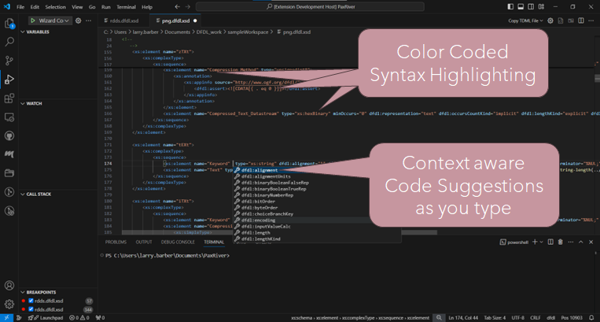|

|

|

|
|:---|:---|
|**IDE Basics**  Integrated Development Environment A single program that integrates all the steps of software development<ul><li>Editing</li><li>***Compiling***</li><li>Execution</li><li>Debugging</li><li>Version Control</li></ul>|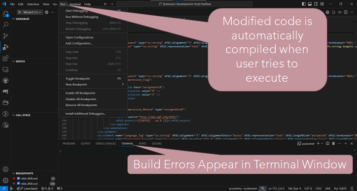|

|

|

|
|:---|:---|
|**IDE Basics**  Integrated Development Environment A single program that integrates all the steps of software development<ul><li>Editing</li><li>Compiling</li><li>***Execution***</li><li>Debugging</li><li>Version Control</li></ul>|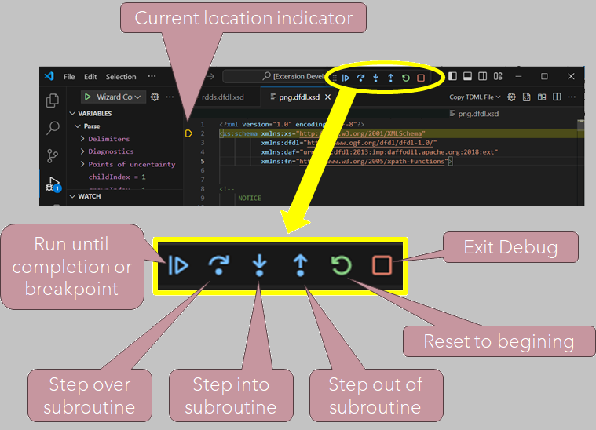|

|

|

|
|:---|:---|
|**IDE Basics**  Integrated Development Environment A single program that integrates all the steps of software development<ul><li>Editing</li><li>Compiling</li><li>Execution</li><li>***Debugging***</li><li>Version Control</li></ul>|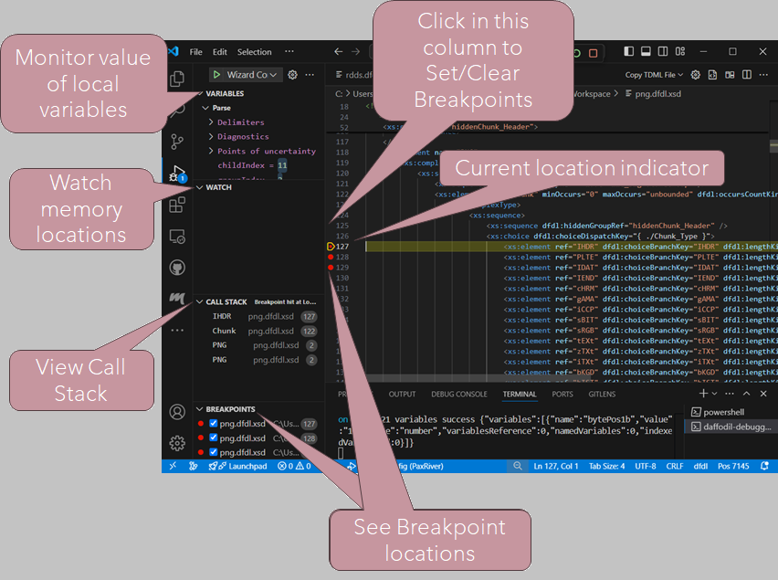|

|

|

|
|:---|:---|
|**IDE Basics**  Integrated Development Environment A single program that integrates all the steps of software development<ul><li>Editing</li><li>Compiling</li><li>Execution</li><li>Debugging</li><li>***Version Control***</li></ul>|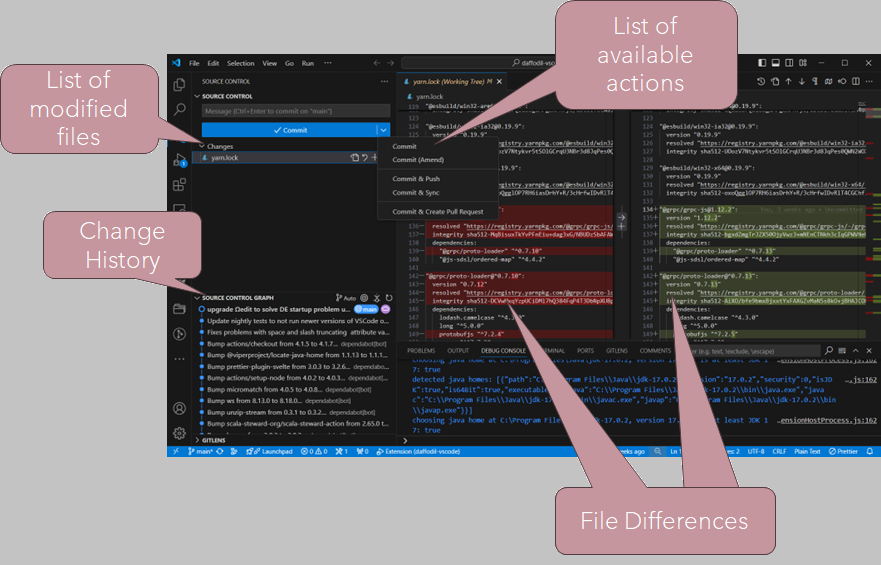|

|

|

|
|:---|:---:|
|Install VS Code    <ul><li>Free and built on open source</li><li>Available for Windows, Linux, macOS and web browsers</li></ul>   | *Click Image for Download Page:*[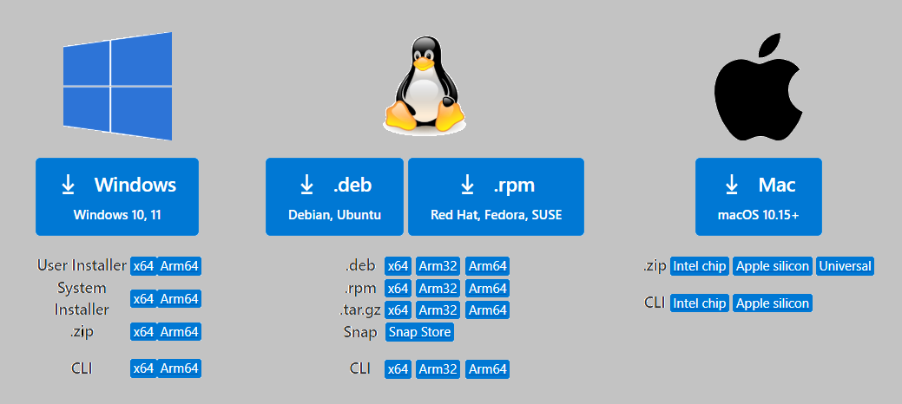](https://code.visualstudio.com/Download)|

|

|

|
|:---|:---|
|**Installing the Daffodil Extension**  <ol><li>***In VS Code, click on the Extensions Icon.***  </li></ol>      |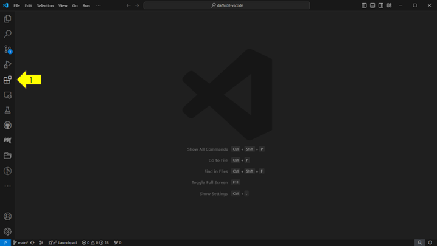|

|

|

|
|:---|:---|
|**Installing the Daffodil Extension**  <ol><li>In VS Code, click on the Extensions Icon</li><li>***Then enter “daffodil” in the search box***</li>    </ol>|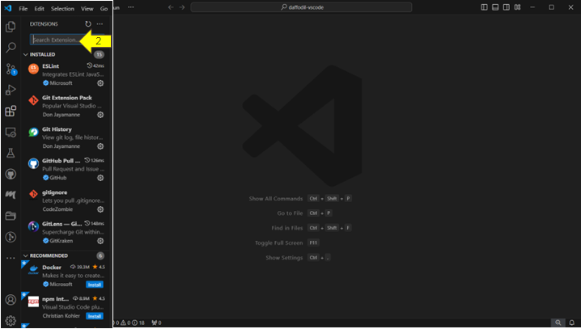|

|

|

|
|:---|:---|
|**Installing the Daffodil Extension**  <ol><li>In VS Code, click on the Extensions Icon.</li><li>Then enter “daffodil” in the search box</li><li>***Click on the Apache Daffodil tile***</li>   |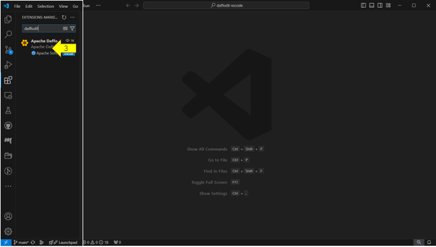|

|

|

|
|:---|:---|
|**Installing the Daffodil Extension**  <ol><li>In VS Code, click on the Extensions Icon.</li><li>Then enter “daffodil” in the search box</li><li>Click on the Apache Daffodil tile</li><li>***Click on the***  `Install` ***button***</li>  |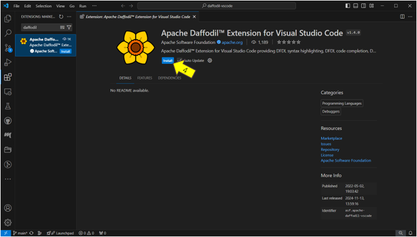|

|

|

|
|:---|:---|
|**Installing the Daffodil Extension**  <ol><li>In VS Code, click on the Extensions Icon.</li><li>Then enter “daffodil” in the search box</li><li>Click on the Apache Daffodil tile</li><li>Click on the Install button</li><li>***Upon installation, the*** `Install` ***button will be replaced by*** `Disable` ***&*** `Uninstall` ***buttons***</li></ol>|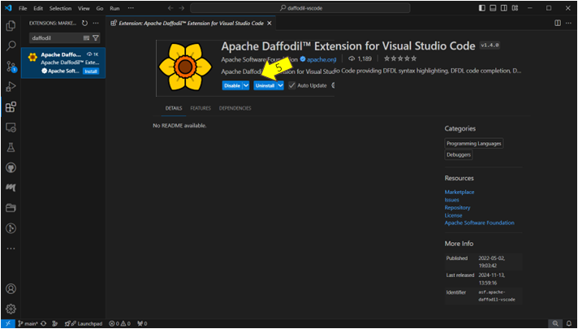|

|

|

|
|:---|:---:|
|***Configuring for First Use*** *Create a working directory* <ul><li>Sample data file</li><li>Sample schema file</ul>   *[Free sample schemas here](https://github.com/DFDLSchemas)*|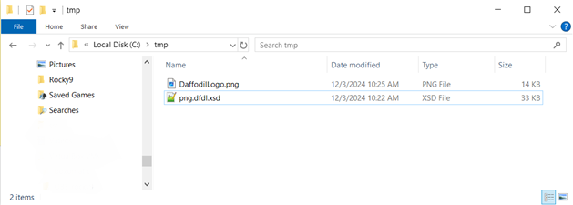*This example uses a Daffdile logo saved as a PNG file*|

|

|

|
|:---|:---|
|***Configuring for First Use*** *Open the working directory*   <ol><li>Click `File`</li><li>Click `Open Folder`</li><li>Navigate to & Select your folder   </ol></li>  |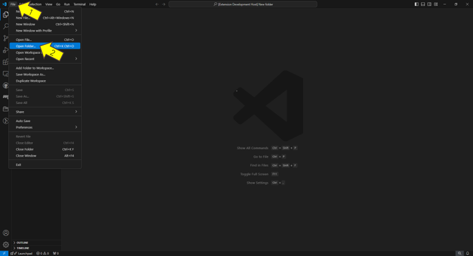|

Note that if you wind up working on multiple DFDL projects in different folders, you will need to configure **each folder** with its own launch.json file

Another important issue to note when choosing working directories is that VSCode, like many IDEs, seems to not like projects that are on paths reachable via symlinks. Using symlinks in paths is highly likely to cause problems and thus should be avoided.

|

|

|
|:---|:---|
|***Configuring for First Use*** *Configuring Launch.json file*  <ul><li>Open the *Launch Config Wizard*<ul><li>Press `Ctrl` + `Shift` + `P`</li><li>In the search bar that opens, begin entering: "Daffodil"</li><li>When the list shows `Daffdodil Debug: Configure launch.json`, select it</li></ul></li></ul>||
|<ul><li>The Launch Config Wizard will open in a new tab.</li></ul>      |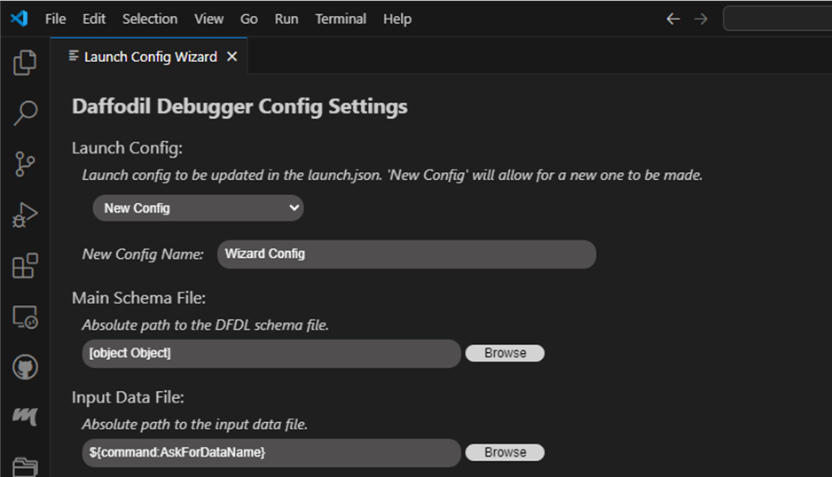|

Note that the debugger **should** run with the **default settings**. You may simply scroll down to the bottom of the configuration wizard and click the `SAVE` button, then close the wizard. If you run into a problem, the most likely problem is that you have not yet opened a working folder/directory. If VS Code opens settings.json instead of launch.json make sure that you have created and opened the intended folder/directory. The second most likely culprit is a port conflict and you can simply reopen the configuration wizard and change the port settings and save the new configuration. 

|

|

|
|:---|:---|
|***Configuring for First Use*** *Launch Config Wizard*  <ul><li>Launch config: The file can hold multiple configurations.</li><ul>
1. Enter a name for the new configuration &emsp;&emsp;&emsp;or 2. Select a previous configuration from the drop-down list
|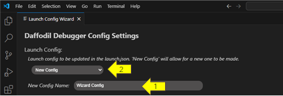|

|

|

|
|:---|:---|
|***Configuring for First Use*** *Launch Config Wizard*||
|*Main Schema File/Input Data File* The input files can be hard coded into the configuration by clicking the `Browse` button and navigating to the file and clicking on it|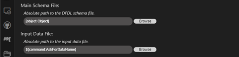|

Leave the `${command:AskForSchemaName}`/`${command:AskForDataName}` values and you will be prompted for the file names each time you execute a parse. *This option can be useful if you will be testing with a variety of input files, rather than running the same files repeatedly*

|

|

|
|:---|:---|
|***Configuring for First Use*** *Launch Config Wizard*||
|*Root Element* For simple schemas, this field may be left set to `undefined` |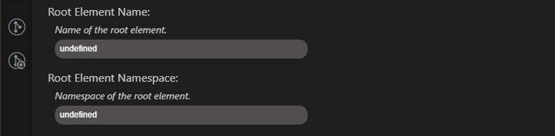|

|

|

|
|:---|:---|
|***Configuring for First Use*** *Launch Config Wizard*||
|*Debugger Settings* <ul><li>Port - Port used for communication between VS Code & Daffodil Debugger.</li><li>Version (Daffodil version) - Specify the version of Daffodil to be used while debugging.</li><li>Timeout - Limit on communication failure before error declared.</li><li>Log File - Specify name & location of the log file.</li><li>Log Level - specify the level of information to be logged.</li><li>Use Existing Server - *ignore* - Used only for backend server developers</li><li>Stop On Entry - Essentially sets a breakpoint on the first line.</li><li>Trace - logging of internal communications</li></ul>||

|

|

|
|:---|:---|
|***Configuring for First Use*** *Launch Config Wizard*||
|*Classpath* <ul><li>Complex schemas often require multiple locations and JAR files. The debugger needs to know where to find these additional files</li></ul>*Infoset*<ul><li>Infoset Format - Select XML or JSON for the ouput</li><li>Output Type - store output to a file or stream to console</li><li>Output Infoset Path - specify the location for the output file</li></ul>|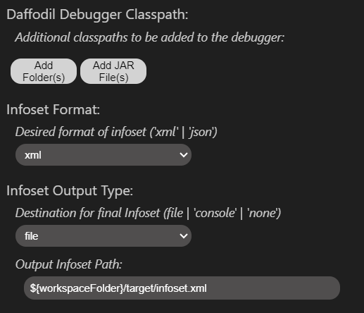|

|

|

|
|:---|:---|
|***Configuring for First Use*** *Launch Config Wizard*||
|<ul><li>Open Data Editor - Display contents of file being parsed. Defaults to Hex, but many configurable settings. Tracks position in file and allows modification of data.</li><li>Open Infoset Diff View - Can show the difference between output results of the current and previous parse.</li><li>Open Infoset View - Displays the partial resulting output of the file parsing. Note that parser often backtracks when portions of the parse are determined to be incorrect.</li></ul>|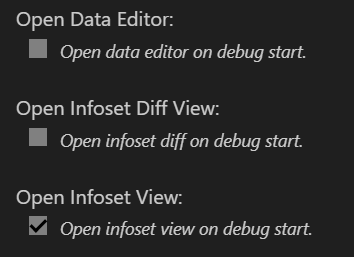|

|

|

|
|:---|:---|
|***Debugging for the first time for Visual Studio Code***||
|Make sure you have open data editor on debug start checked in launch config wizard||

|

|

|
|:---|:---|
|***Configuring for First Use*** *Launch Config Wizard* TDML Options||
|<ul><li>Drop down list of valid TDML Actions.</li><li>Desired filename for the TDML file.</li></ul>||

|

|

|
|:---|:---|
|***Configuring for First Use*** *Launch Config Wizard* Data Editor Configuration||
|<ul><li>Omega-edit port - allows user to specify which port will be used for communication between VS Code & the backend server.</li><li>Name/location of the log file which records communication between VS Code and the backend server.</li><li>Drop down list of the valid log levels.</li></ul>|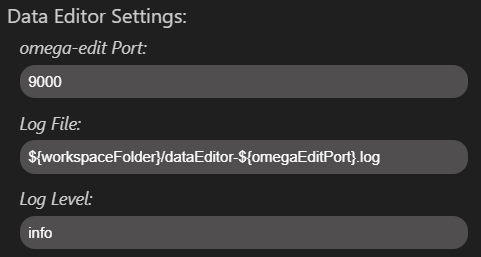|

|

|

|
|:---|:---|
|***Configuring for First Use*** *Launch Config Wizard*||
|Don't forget to save your configuration settings!  If you have a problem saving your settings, verify that you have opened a valid working folder.||
|||

|

|

|
|:---|:---|
|***Debugging for the first time for Visual Studio Code***||
|Click on play button to start a DFDL schema debugging session||

|

|

|
|:---|:---|
|***Debugging for the first time for Visual Studio Code***||
|You will see the data editor pop up!||

|

|

|
|:---|:---|
|***Generate TDML Temporary File***||
|In launch config wizard, set TDML action to generate, and save.    ***Note: You can go back to previously set configs and edit them and save those changes***||

|

|

|
|:---|:---|
|***Generate TDML Temporary File***||
|Run the corresponding DFDL debug extension from prior step.  ||

|

|

|
|:---|:---|
|***Generate Temporary TDML File***||
|Press the continue button to produce the infoset.  ||

|

|

|
|:---|:---|
|***Generate Temporary TDML File***||
|When the infoset generates, a temporary TDML schema will generate.  ||

|

|

|
|:---|:---|
|***Create TDML File***||
|Close all windows except the DFDL schema window.  Click “Create TDML File” in the command view panel or "Daffodil Debug: Create TDML File" in the command palette.  ||

|

|

|
|:---|:---|
|***Create TDML File***||
|Enter a name for the TDML file, click “Save TDML File. Save the TDML in the current project folder, folder that's currently open in VS Code.  ||

|

|

|
|:---|:---|
|***Create TDML File***||
|Close the DFDL schema in the editor window.  Click the explore tab to verify file is in project folder.   ||

|

|

|
|:---|:---|
|***Execute TDML File***||
|Open the TDML file.   ||

|

|

|
|:---|:---|
|***Execute TDML File***||
|After the TDML file opens, select the “Execute TDML” option from the dropdown, or “Execute TDML” in the command view panel, or "Daffodil Debug: Execute TDML" in the command palette.    ||

|

|

|
|:---|:---|
|***Execute TDML File***||
|Select the name of the test case to execute.   ||

|

|

|
|:---|:---|
|***Execute TDML File***||
|The DFDL schema and a new infoset will utilize the values from the TDML file.     ||
