# Apache Daffodil™ Extension for Visual Studio Code

The Apache Daffodil™ Extension for Visual Studio Code is an extension to the Microsoft® Visual Studio Code (VS Code) editor which enables [Data Format Description Language (DFDL)](https://daffodil.apache.org/docs/dfdl/) syntax highlighting, code completion, and the interactive debugging of DFDL Schema parsing operations using [Apache Daffodil™](https://daffodil.apache.org/).

DFDL is a data modeling language used to describe file formats.  The DFDL language is a subset of eXtensible Markup Language (XML) Schema Definition (XSD). File formats are rich and complex-- it requires a modeling language to describe them. Developing DFDL Schemas can be challenging, requiring a lot of iterative development, and testing.

The purpose of Apache Daffodil™ Extension for Visual Studio Code is to ease the burden on DFDL Schema developers, enabling them to develop high-quality, DFDL Schemas, in less time.  VS Code is free, open source, cross-platform, well-maintained, extensible, and ubiquitous in the developer community. These attributes align well with the Apache Daffodil™ project and the Apache Daffodil™ Extension for Visual Studio Code.

## Table of Contents


- [Apache Daffodil™ Extension for Visual Studio Code](#apache-daffodil-extension-for-visual-studio-code)
   * [Table of Contents](#table-of-contents)
   * [Bundled Tools in the Apache Daffodil™ Extension for Visual Studio Code](#bundled-tools-in-the-apache-daffodil-extension-for-visual-studio-code)
      + [DFDL Syntax Highlighting](#dfdl-syntax-highlighting)
      + [DFDL Schema Code Completion](#dfdl-schema-code-completion)
      + [Addition of Intellisense Hover Capability](#addition-of-intellisense-hover-capability)
      + [Daffodil Data Parse Debugger](#daffodil-data-parse-debugger)
      + [Data Editor](#data-editor)
      + [Daffodil Test Data Markup Language (TDML)](#daffodil-test-data-markup-language-tdml)
- [Prerequisites](#prerequisites)
- [Installing the Apache Daffodil™ Extension for Visual Studio Code](#installing-the-apache-daffodil-extension-for-visual-studio-code)
   * [Option 1: Install the Apache Daffodil™ Extension for Visual Studio Code From the Visual Studio Code Extension Marketplace](#option-1-install-the-apache-daffodil-extension-for-visual-studio-code-from-the-visual-studio-code-extension-marketplace)
   * [Option 2: Install the Latest .Vsix File From the Apache Daffodil™ Extension for Visual Studio Code Release Page](#option-2-install-the-latest-vsix-file-from-the-apache-daffodil-extension-for-visual-studio-code-release-page)
- [Introductory Guide](#introductory-guide)
- [DFDL Schema Authoring Using Code Completion](#dfdl-schema-authoring-using-code-completion)
   * [Set the Editor to "dfdl" mode](#set-the-editor-to-dfdl-mode)
   * [DFDL Schema Authoring Features](#dfdl-schema-authoring-features)
- [Debugging a DFDL Schema Using the Apache Daffodil™ Extension for Visual Studio Code’s Bundled Daffodil Data Parse Debugger](#debugging-a-dfdl-schema-using-the-apache-daffodil-extension-for-visual-studio-codes-bundled-daffodil-data-parse-debugger)
   * [Debug Configuration](#debug-configuration)
   * [Dropdown for Log Level](#dropdown-for-log-level)
   * [Root element and namespace auto suggestions/finding](#root-element-and-namespace-auto-suggestionsfinding)
   * [Launch a DFDL Parse Debugging Session](#launch-a-dfdl-parse-debugging-session)
   * [Other Options for Launching a DFDL Parse Debugging Session](#other-options-for-launching-a-dfdl-parse-debugging-session)
   * [Setting Breakpoints in the schema](#setting-breakpoints-in-the-schema)
   * [Custom DFDL Debugger Views](#custom-dfdl-debugger-views)
      + [Infoset Tools](#infoset-tools)
      + [Inputstream Hex Viewer](#inputstream-hex-viewer)
- [DFDL Command Panel](#dfdl-command-panel)
- [TDML Support](#tdml-support)
- [Data Editor](#data-editor-1)
   * [Navigation](#navigation)
   * [Keyboard Shortcuts](#keyboard-shortcuts)
- [Known Issues in v1.4.1](#known-issues-in-v141)
   * [General Issues](#general-issues)
   * [Debugger Issues Originating from 1.4.0](#debugger-issues-originating-from-140)
- [Reporting Problems and Requesting New Features](#reporting-problems-and-requesting-new-features)
- [Getting Help](#getting-help)
- [Contributing](#contributing)
- [Additional Resources](#additional-resources)

## Bundled Tools in the Apache Daffodil™ Extension for Visual Studio Code

### [DFDL Syntax Highlighting](https://github.com/apache/daffodil-vscode/wiki/Apache-Daffodil%E2%84%A2-Extension-for-Visual-Studio-Code:-v1.4.1#set-the-editor-to-dfdl-mode)

DFDL is rich and complex.  Developers using modern code editors expect some degree of built-in language support for the language they are developing, and DFDL should be no different.  The Apache Daffodil™ Extension for Visual Studio Code provides syntax highlighting to improve the readability and context of the text.  In addition, the syntax highlighting provides feedback to the developer indicating the structure and code appear syntactically correct.

### [DFDL Schema Code Completion](https://github.com/apache/daffodil-vscode/wiki/Apache-Daffodil%E2%84%A2-Extension-for-Visual-Studio-Code:-v1.4.1#dfdl-schema-authoring-using-code-completion)

The Apache Daffodil™ Extension for Visual Studio Code provides code completion, also known as “Intellisense”, offering context-aware code segment predictions that can dramatically speed up DFDL Schema development by reducing keyboard input, memorization by the developer, and typos.

### Addition of Intellisense Hover Capability
Hovering over a DFDL schema element will provide information about that DFDL element.


### [Daffodil Data Parse Debugger](https://github.com/apache/daffodil-vscode/wiki/Apache-Daffodil%E2%84%A2-Extension-for-Visual-Studio-Code:-v1.4.1#debugging-a-dfdl-schema-using-the-apache-daffodil-extension-for-visual-studio-codes-bundled-daffodil-data-parse-debugger)

The Apache Daffodil™ Extension for Visual Studio Code provides a Daffodil Data Parse Debugger which enables the developer to carefully control the execution of Apache Daffodil™ parse operations.  Given a DFDL Schema and a target data file, the developer can step through the execution of a parse line by line, or until the parse reaches some developer-defined location, known as a breakpoint, in the DFDL Schema.  What is particularly helpful is that the developer can watch the parsed output, known as the "infoset", as it’s being created by the parser, and see where the parser is parsing in the data file-- enabling the developer to quickly discover and correct issues, improving DFDL Schema development and testing cycles.

### [Data Editor](https://github.com/apache/daffodil-vscode/wiki/Apache-Daffodil%E2%84%A2-Extension-for-Visual-Studio-Code:-v1.4.1#data-editor-1)

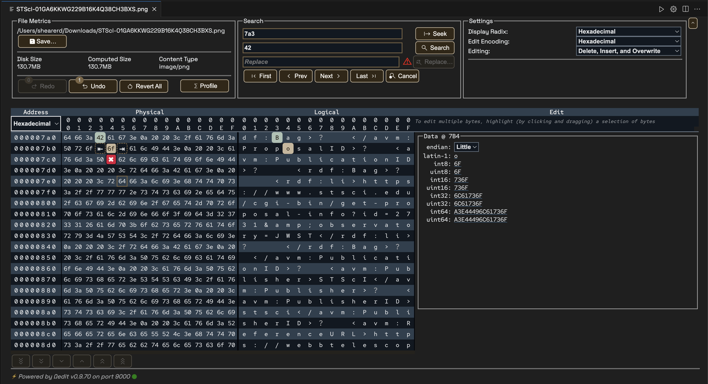

The Apache Daffodil™ Extension for Visual Studio Code provides an integrated data editor.  It is akin to a hex editor but tuned specifically for challenging Daffodil use cases.  As an editor designed for Daffodil developers by Daffodil developers, features of the tool will evolve quickly to address the specific needs of the Daffodil community.

### [Daffodil Test Data Markup Language (TDML)](https://github.com/apache/daffodil-vscode/wiki/Apache-Daffodil%E2%84%A2-Extension-for-Visual-Studio-Code:-v1.4.1#tdml-support)

The Apache Daffodil™ Extension for Visual Studio Code provides TDML support. [TDML is a way of specifying a DFDL schema, input test data, and expected result or expected error/diagnostic messages, all self-contained in an XML file](https://daffodil.apache.org/tdml/). By convention, a TDML file uses the file extension `.tdml`, or `.tdml.xml`.

TDML files can be included for inquiries about DFDL's inner workings. For example, when uploading files to the Daffodil users mailing list, it may be easier to upload a zip file containing a TDML file, the DFDL Schema file, the input data file, and, optionally, the infoset file. Sending this file to the users mailing list will allow other users to unpack your zip file and run your test case. It becomes even easier if you have multiple test cases. It allows for a level of precision that is often lacking, but also often required when discussing complex data format issues. As such, providing a TDML file along with a bug report is the best way to demonstrate a problem. [You can read more about TDML on the Apache Daffodil™ website](https://daffodil.apache.org/tdml/).

# Prerequisites

This guide assumes VS Code and a Java Runtime Environment (Java 8 or greater) are installed.

* [Install VS Code, version 1.82.0 or greater](https://code.visualstudio.com/download)
* [Install Java Runtime 8 or greater](https://docs.oracle.com/goldengate/1212/gg-winux/GDRAD/java.htm#BGBFJHAB)
* On Linux, glibc 2.31 or greater is required

# Installing the Apache Daffodil™ Extension for Visual Studio Code

The Apache Daffodil™ Extension for Visual Studio Code can be installed using one of two methods.

## Option 1: Install the Apache Daffodil™ Extension for Visual Studio Code From the Visual Studio Code Extension Marketplace

The Apache Daffodil™ Extension for Visual Studio Code is available in the [Visual Studio Code Extension Marketplace](https://marketplace.visualstudio.com/vscode). This option is recommended for most users.

## Option 2: Install the Latest .Vsix File From the Apache Daffodil™ Extension for Visual Studio Code Release Page

The latest `.vsix` (the file extension used for VS Code extensions) file can also be downloaded from the Apache Daffodil™ Extension for Visual Studio Code [releases page](https://github.com/apache/daffodil-vscode/releases) and installed by either:

  * Using the command-line via `code --install-extension <path-to-downloaded-vsix-file>`; or
  * Use the "Extensions: Install from VSIX" command from within VS Code by opening the Command Palette (Mac = Command+Shift+P, Windows/Linux = Ctrl+Shift+P), and typing `vsix` to bring up the command and pointing it at the downloaded `.vsix` file.

# Introductory Guide

For beginners that are new to the extension, please read our [introductory guide](https://github.com/apache/daffodil-vscode/wiki/Introduction-to-Daffodil-VS-Code-Extension) to quicky get started using the extension.

# DFDL Schema Authoring Using Code Completion

## Set the Editor to "dfdl" mode

The extension will automatically detect files with the DFDL Schema extension `dfdl.xsd` and set the editor window to dfdl mode in the bottom right of the status bar. 


In the event automatic DFDL file detection doesn't work, one can manually select the editor to be in DFDL mode. This can be done by selecting the language mode in the bottom right of the status bar and then configuring file associations. 


## DFDL Schema Authoring Features

Auto-suggest is triggered using `CTRL + space` or typing the beginning characters of an item.  Typing one or more unique characters will further limit the results.

📝 **NOTE:** Intellisense is *context aware*, so there is no need to begin a block with `<`, just start typing the tag name, and code completion will automatically handle it as appropriate.

Code completion can be used to add a schema block, with just a couple of keystrokes. Code completion can make short work out of completing a DFDL Format Block, offering context-sensitive suggestions for attribute and element values.

The `>` or `/` characters close XML tags.  Use `tab` to select an item from the dropdown and to exit double quotes.

Code completion supports creating self-defined `dfdl:complextypes` and `dfdl:simpleTypes`.

The `tab` key completes an auto-complete item within an XML tag. After auto-complete is triggered, typing the initial character or characters will limit the suggestion results. Inside an XML tag a `space` or `carriage return` will trigger a list of context-sensitive attribute suggestions.


Install the Apache Daffodil VS Code Extension from the VS Code Marketplace.


Open a schema file in the editor and set the language mode located in the bottom right corner to dfdl. 


Click the language in the bottom right of the status bar or type Ctrl+Shift+p and enter 'language mode', then select dfdl from the list of available languages.


Press ctrl+space in the empty editor window. The XML version declaration should appear as the only choice. Select that choice by pressing the enter key.


Press ctrl+space again and the schema choice will show. Press enter to accept the schema choice.


Select nul, or one of the other choices in the choice list. If you select nul for no namespace, you will need to backspace over the null character to remove it. If you want to type in a different namespace choice, remove null and type in your namespace choice followed by a colon ‘:’. 
If you select a namespace option here, it will be used throughout the schema as a namespace prefix to standard XML elements. The dfdl namespace prefix will automatically be added to dfdl elements.  After selecting or writing in a namespace option, press the tab key to move to the end of the schema tag block.


At the end of the schema tag block, you can type ‘>’ to auto-end the schema block. Intellisense will place the end tag character on the schema open tag block, create the schema closing tag, and position the cursor between the tags.


Press ctrl+space to get a list of element type choices available within the schema tags. Select a choice and press enter.


Attributes can be supplied in the sequence open tag. To get a list of attribute choices press space at the cursor position. Intellisense will open a menu that allows a selection of an attribute. If the attribute has predetermined choices a list of those will appear after the attribute is selected.


The separator attribute doesn’t have a specific list of choices. The comma was manually entered to provide a value to the field. Press tab to exit the double quotes. The cursor will be positioned immediately after the ending double quote.


Type space again to choose another attribute, or type / to create a self-closing tag. After typing a slash to close the tag, the cursor will be positioned at the end of the tag. Press enter to continue on the next line.


Press ctrtl+space to get a list of element choices.


A tag can also be closed by typing ‘>’ at the cursor position after the tag.


Closing a tag with a ‘>’ will normally result in a closing tag on a new line and the cursor positioned between the two tags. (If an open tag is split over multiple lines, the closing tag is not moved to the next line. This behavior can be changed based on community input).


Press ctrl+space on the empty line to get a list of element choices available between tags.


Select a choice by pressing enter. In this example the element tag with the attribute name was selected and a value for name entered. Press tab to exit the double quotes after entering a name value. The name attribute doesn’t have a specific list of choices.


Type ctrl+space to get a list of attribute choices for the element tag.


Selecting an attribute that has predetermined choices will supply a list of those choice. Select an item from the list and press enter. End the tag with ‘>’ to get a closing tag on a new line with the cursor positioned between the tags.


On the new line press ctrl+space to get a list of element choices for the element tag. 


Select a choice and press ctrl+space to get list of choices for the selected annotation tag set.


Select a choice and press ctrl+space to supply a list of choices available in the appinfo tag set.


Select a choice by pressing enter.


The discriminator test dfdl attribute doesn’t have a specific list of choices. Press tab to exit the double quotes. The cursor will be positioned immediately after the ending double quote.


To add additional attributes to an existing element tag, position the cursor within the opening tag, press ctrl+space, or space to get a list of attribute choices for that tag.


Adding a new line anywhere in the schema and pressing ctrl+space will provide a list of choices available between the tags at the current position.


If a closing tag is deleted or missing, type ‘>’ to re-add the closing tag at the cursor position.


The closing tag will be re-added and cursor will be placed at the end of the line.

XPath expressions can be code-completed.

# Debugging a DFDL Schema Using the Apache Daffodil™ Extension for Visual Studio Code’s Bundled Daffodil Data Parse Debugger

## Debug Configuration

Debugging a DFDL Schema needs both the DFDL Schema to use and a data file to parse. Instead of having to select the DFDL Schema and the data file each time from a file picker, a "launch configuration" can be created, which is a JSON description of the debugging session.

To create the launch profile:

1. Before proceeding to the next steps, ensure you have opened a desired working directory. Select `File -> Open Folder` from the VS Code menu bar. This will allow you to select a desired working directory. 

2. Select `Run -> Open Configurations` from the VS Code menu bar. This will load a `launch.json` file into the editor. There may be existing `configurations`, or it may be empty.

3. Press `Add Configuration...` and select the `Daffodil Debug - Launch` option.

Once the `launch.json` file has been created it will look something like this

```json
{
  "type": "dfdl",
  "request": "launch",
  "name": "Ask for file name",
  "program": "${command:AskForProgramName}",
  "stopOnEntry": true,
  "data": "${command:AskForDataName}",
  "infosetOutput": {
    "type": "file",
    "path": "${workspaceFolder}/infoset.xml"
  },
  "debugServer": 4711
}
```

This default configuration will prompt the user to select the DFDL Schema and data files.  If desired, the "program" and "data" elements can be mapped to the user's files to avoid being prompted each time.

📝 Note: Use `${workspaceFolder}` for files in the VS Code workspace and use absolute paths for files outside the workspace.

```json
{
  "type": "dfdl",
  "request": "launch",
  "name": "DFDL parse: My Data",
  "program": "${workspaceFolder}/schema.dfdl.xsd",
  "stopOnEntry": true,
  "data": "/path/to/my/data",
  "infosetOutput": {
    "type": "file",
    "path": "${workspaceFolder}/infoset.xml"
  },
  "debugServer": 4711
}
```

## Dropdown for Log Level
A dropdown list has been added in the launch config wizard under Log Level settings. There are four different options to select including DEBUG, INFO, WARNING, ERROR, and CRITICAL.

* Debug - A log level used for events considered to be useful during software debugging when more granular information is needed
* Info - An event happened, the event is purely informative and can be ignored during normal operations
* Warning - Unexpected behavior, but key features still works
* Error - One or more functionalities not working as expected
* Critical - Key feature not working, preventing whole program from working


Referenced Links:
* https://sematext.com/blog/logging-levels/
* https://www.crowdstrike.com/en-us/cybersecurity-101/next-gen-siem/logging-levels/

## Root element and namespace auto suggestions/finding
In the launch.json file, there's a new suggestion mode that gives you suggestions to fill in for the rootname. If you specify the specific schema path, and then save the file, and reopen it. Go to rootname and delete whatever value is set-- it will show you various suggestions.


## Launch a DFDL Parse Debugging Session

Using the launch profile above a `DFDL parse: My Data` menu item at the top of the `Run and Debug` pane (Command-Shift-D) will display. Then press the `play` button to start the debugging session.

In the Terminal, log output from the DFDL debugger backend service will display.  If something is not working as expected, check the output in this Terminal window for hints.

The DFDL Schema file will also be loaded in VS Code and there should be a visible marking at the beginning where the debugger has paused upon entry to the debugging session. Control the debugger using the available VS Code debugger controls such as `setting breakpoints`, `removing breakpoints`, `continue`, `step over`, `step into`, and `step out`.

## Other Options for Launching a DFDL Parse Debugging Session

* **Option 1:**
  * Open the DFDL Schema file to debug
  * From inside the file open the Command Palette (Mac = Command+Shift+P, Windows/Linux = Ctrl+Shift+P)
  * Once the command Palette is opened start typing `Daffodil Debug:`
    * Option 1 = `Daffodil Debug: Debug File` - This will allow the user to fully step through the DFDL Schema.  Once fully completed, it will produce an infoset to a file named `SCHEMA-infoset.xml` which it then opens as well.
    * Option 2 = `Daffodil Debug: Run File` - This will run the DFDL Schema, producing the infoset to a file named `SCHEMA-infoset.xml`.

* **Option 2:**
  * Open the schema file to debug
  * Click the play button in the top right, two options will be provided:
    * Option 1 = `Debug File` - This will allow the user to fully step through the schema (WIP).  Once fully completed, it will produce an infoset to a file named `SCHEMA-infoset.xml` which it then opens as well.
    * Option 2 = `Run File` - This will run the DFDL Schema, producing the infoset to a file named `SCHEMA-infoset.xml` which it then opens as well.

## Setting Breakpoints in the schema
If you want to be able to set breakpoints in the schema file, make sure that the language mode is set to DFDL. If not, it will not allow you to set breakpoints in the file. To change the language mode, click on the language on the bottom right where DFDL is, and the command palette will allow you to select various languages. 


## Custom DFDL Debugger Views

### Infoset Tools

Find the infoset tools from the command menu (Mac = Command+Shift+P, Windows/Linux = Ctrl+Shift+P)

### Inputstream Hex Viewer

Find the hex view from the command menu (Mac = Command+Shift+P, Windows/Linux = Ctrl+Shift+P)

# DFDL Command Panel
Enhanced Debugging in Visual Studio Code (VS Code) by developing a dedicated command panel for DFDL. Now, all debugging-related commands are conveniently grouped in one place, making them easier to find and use. This command panel dynamically updates to only show relevant commands based on the current debug mode and can be quickly executed using a play button.


Commands will only appear on this panel if they are valid in the current context. Below is a table showing when these commands are enabled. The bottom section in the first screenshot describes the keywords used by the extension to dynamically figure out whether to enable a command. Splitting them into two screenshots to prevent distortion.


# TDML Support
When uploading files to the mailing list, it may be easier to upload a zip file containing a TDML file, the DFDL Schema file, the input data file, and, optionally, the infoset file. Sending this file to the mailing list will allow other users to unpack your zip file and run your test case. It becomes even easier if you have multiple test cases.

To Generate a TDML file, use similar steps for Launching a DFDL Parse Debugging Session:
* Open the DFDL Schema file
* From inside the file, open the Command Palette (Mac = Command+Shift+P, Windows/Linux = Ctrl+Shift+P)
* Once the Command Palette is opened, select the `Daffodil Debug: Generate TDML` command
* From there, you will be asked to provide the input data file, the TDML test case name, and the location/name for the TDML file.

<details>
<summary>Visual steps to generate a TDML file</summary>

Set the TDML Action to generate and give a TDML Test Case Name.


Run the debug extension and choose a DFDL schema and data file. Make sure the language mode is DFDL.


Press the continue button to produce the infoset.


When the infoset generates, a temporary TDML schema file will generate.


</details>

Once the Daffodil Parse has finished, an infoset and a temporary TDML schema file will be created. The TDML file contains relative paths to the DFDL Schema file, input data file, and infoset file. When creating an archive for these files, preserve the directory structure in the archive.

<details>
<summary>Notes regarding the temporary TDML schema file</summary>

The temporary TDML schema will be generated in your operation system's temp directory as `generatedTDML.tdml`. On Windows, `generatedTDML.tdml` will be in `C:\Users\USERNAME\AppData\Local\Temp` folder. Note that this value will be hardcoded for the immediate future because of how Append/Create interact with the generated TDML file.


For copying the TDML file and appending TDML test case(s) as described below, the extension uses the latest version of `generatedTDML.tdml` for the operations. Regenerating the TDML schema updates the temporary TDML schema. This also means that `generatedTDML.tdml` must already exist in your system's temp directory to work properly. Otherwise, an error message will be displayed. 


</details>

<details>
<summary>Visual steps to copy the temporary TDML file to your project.</summary>

Click on command view tab.  Click “Create TDML File” in the command view.  


Enter a name for the TDML file, click “Save TDML File.  


Close the DFDL schema in the editor window.  Click the explore tab to verify file is in project folder.  

</details>

To Append a new test case to an existing TDML file, use similar steps for Generating a TDML file:
* Open a TDML file in a tdml editor
* From inside the file, Change the test case name and save the file
* Open the command view, select Append TDML
* The Append option will append the TDML from the temp directory to the currently open TDML if the two files are different

<details>
<summary>Visual steps to append to a TDML file</summary>

To append to the existing TDML file, open the TDML file and click the button in the upper right corner to open in a text editor.  


Change the test case name and save the file.


Select append from the TDML from the command view.


The original default test case from the temp directory will be appended to the saved TDML file with the renamed new test case.


</details>

Once the Daffodil Parse has finished, an infoset will be created, and a test case will be added to the existing TDML file. To create an archive for a TDML file with multiple test cases, the same guidelines for creating an archive from a TDML file created from a 'Generate TDML' operation should be followed. All DFDL schema files, input data files, the TDML file, and, optionally, the infosets should be added to the archive. Additionally, any directory structure should be preserved in the archive to allow for the relative paths in the TDML file to be resolved.

When running a zip archive created by another user, extract the archive into your workspace folder. If there is an infoset in the zip archive that you wish to compare with your infoset, make sure that the infoset from the zip archive is not located at the same place as the default infoset for the Daffodil Parse that will be run when executing a test case from the TDML file. This is because the Daffodil Parse run by executing the TDML test case uses the default location for its infoset and will overwrite anything that already exists there.

To Execute a test case from a TDML file, use the following steps: 
* Open a TDML file in a text editor
* From inside the file, open the Command View
* Once the Command View is opened, select the `Execute TDML` command
* The DFDL schema and a new infoset will utilize the values from the TDML file.

<details>
<summary>Visual steps to execute a TDML file</summary>

<details>
<summary>Method 1: Inside a TDML file</summary>
Click on the explore tab to display the file view. Select a TDML file. 


After the TDML file opens, select the “Execute TDML” option from the command view.


The DFDL schema and a new infoset will utilize the values from the TDML file. 

</details>

<details>
<summary>Method 2: launch.json Configuration</summary>

Open the `launch.json` configuration wizard


In your config, set the TDML action to `execute`, specify the TDML test case name and file path, and then save the config. Note: The TDML file path defaults to `${AskForValidatedTDMLPath}` which indicates that a file dialog will prompt you for the TDML file to perform execute on, but you can set it to a file path directly pointing to a specific TDML file.


Execute the configuration you created


If you have `${AskForValidatedTDMLPath}` for the TDML file path, pick the TDML file you want to execute in the file prompt


Your TDML file and TDML test case should be executing


</details>

</details>

A Daffodil Parse will then be launched. The DFDL Schema file and input data file to be used are determined by the selected test case in the TDML file. Optionally, the infoset generated from this parse can be compared to an infoset included in the zip archive containing the TDML file.

# Data Editor

This version of the Apache Daffodil™ Extension for Visual Studio Code includes a new Data Editor.  To use the Data Editor, open the VS Code command palette and select `Daffodil Debug: Data Editor`.

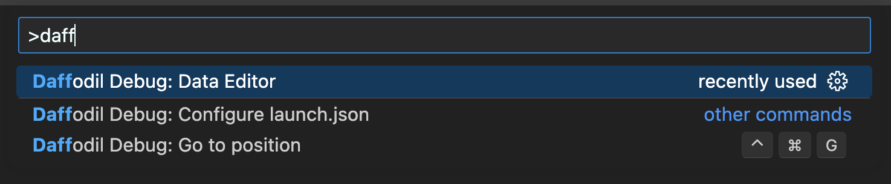

A notification message will appear that informs where the Data Editor logged to. If problems occur, check this log file.

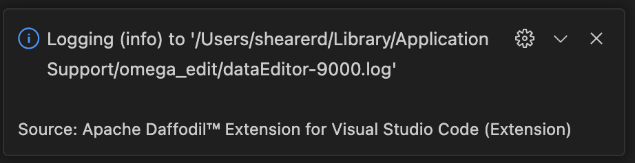

Once the extension is connected to the server, the bottom left corner of the Data Editor shows the version of the Ωedit™ server powering the editor, and the port it's connected to.  Hovering over the filled circle shows the CPU load average, the memory usage of the server in bytes, the server session count, the server uptime measured in seconds, and the round-trip latency measured in milliseconds.


After selecting a file to edit, there will be a table with controls at the top of the Data Editor.

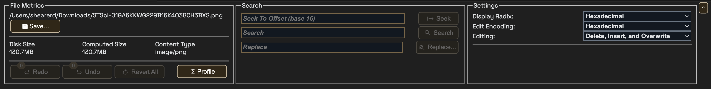

The first section of the table is called `File Metrics` and it contains the path of the file being edited, its initial size in bytes [`Disk Size`], the size as the file is being edited [`Computed Size`], and the detected Content Type.  When changes are committed, the `Save` button will become enabled, allowing the changes to be saved to the file.  The `Redo` and `Undo` buttons will redo and undo edit change transactions.  The `Revert All` button will revert all edit changes since the file was opened. The `Profile` button will open the `Data Profiler` and allow profiling of all or a portion of the edited file.

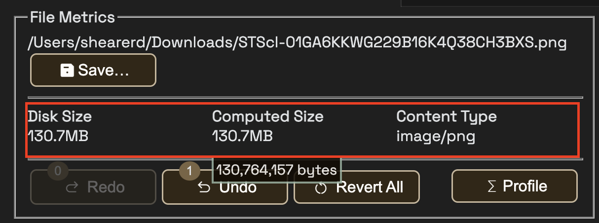

The `Data Profiler` allows for byte frequency profiling of all or a section of the file starting at an editable start offset and ending at an editable end offset, or an editable length of bytes.  The offsets and lengths will use the chosen `Address Radix`.  The frequency scale can be either `Linear` or `Logrithmic`.  The graph can have either an `ASCII` overlay that appears behind the graph, or `None` for no overlay behind the graph.  Hover over the bars to see the byte frequency and value.  The frequency data can be downloaded as a Comma Separated Value (CSV) file using the `Profile as CSV` button.  Click anywhere outside the `Data Profiler` to close it.

📝 Note: The maximum length of bytes profiled in this version is capped at 10,000,000 (10M).

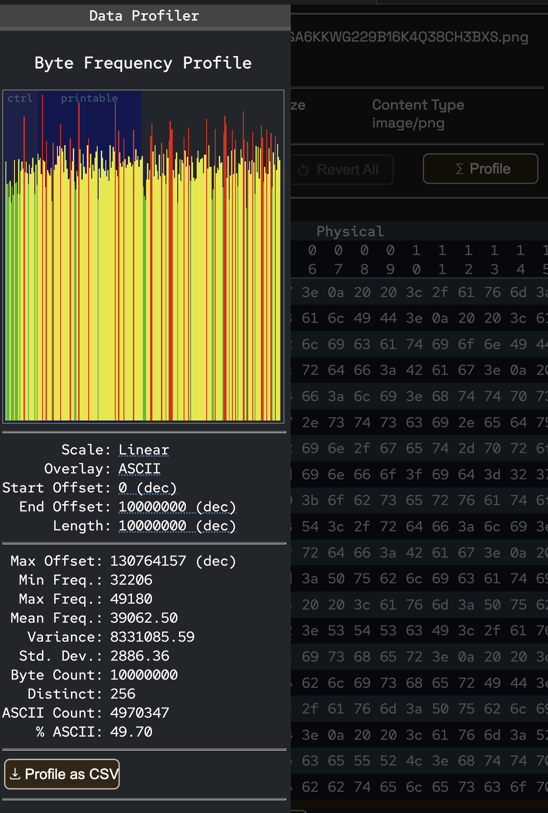

The second section of the table is called `Search`, and it allows for seeking a desired offset and searching of byte sequences in the given `Edit Encoding` in the edited file.  The `Seek` input box uses the selected `Address Radix` as the seek radix. If the `Edit Encoding` can be case-insensitive, a `Case Insensitive` toggle (located inside the `Search` input box) will be displayed allowing for that option to be enabled.  The found sequences can be examined using the `First`, `Prev`, `Next`, and `Last` buttons in this section.  The search can be canceled using the `Cancel` button.

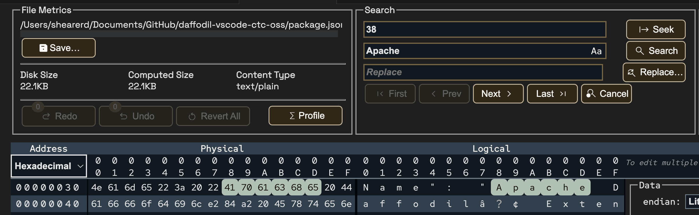

Found sequences can also be replaced in the given `Edit Encoding` by filling in a replacement sequence and clicking the `Replace...` button.

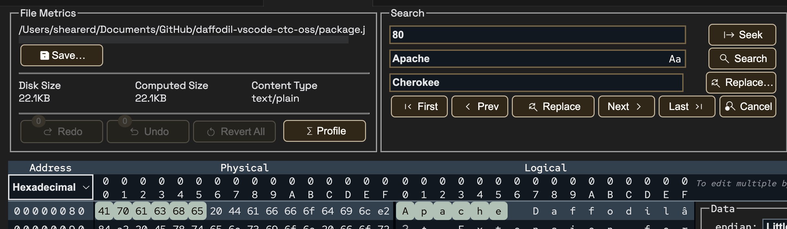

The third section of the table is called `Settings`, and it allows for setting the `Display Radix`, `Edit Encoding`, and `Editing` modes.

The `Display Radix` can be one of *Hexadecimal*, *Decimal*, *Octal*, or *Binary*, and will affect the bytes displayed in the `Physical` viewport.

The `Edit Encoding` can be one of *Hexadecimal*, *Binary*, *ASCII (7-Bit)*, *Latin-1 (8-bit)*, *UTF-8*, or *UTF-16LE* and will affect the selected bytes being edited in the `Edit` viewport. 

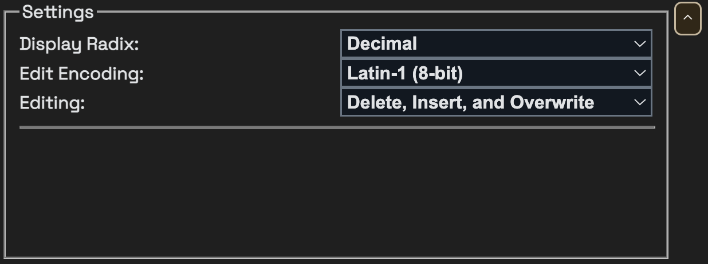

In `Single Byte Edit Mode`, individual bytes may be *deleted*, *inserted* (to the left or the right of the selected byte), and *overwritten* in the `Single Byte Edit Window` that appears when a byte in the `Physical` or `Logical` viewports is clicked.

Mouse over the buttons of the `Ephemeral Edit Window` to determine what each button does.  Mouse over the `Input Box` and it will show the byte offset position in the `Address Radix` selected radix.  Buttons will become enabled or disabled depending on whether there is valid input in the `Input Box`.  Values entered in the `Input Box` must match the format set by the byte `Display Radix` when editing bytes in the `Physical` viewport or be in *Latin-1 (8-bit ASCII)* format when editing bytes in the `Logical` viewport.

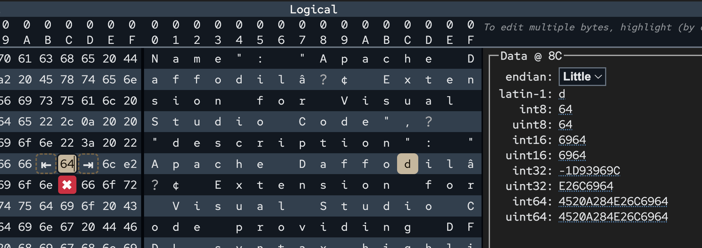

When clicking on a single byte in either the `Physical` or `Logical` viewports, the `Data Inspector` will populate giving the value of the byte in Latin-1, and various integer formats for the selected endianness.  The `Data Inspector` will also show the byte offset position in the `Address Radix` selected radix. The values in the `Data Inspector` are editable by clicking on the value and entering a new value.

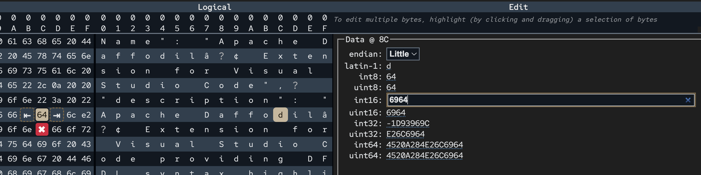

In `Multiple Byte Edit Mode`, a segment of bytes is selected from either the `Physical` or `Logical` viewports, then the selected segment of bytes is edited in the `Edit` viewport using the selected `Edit Encoding`.

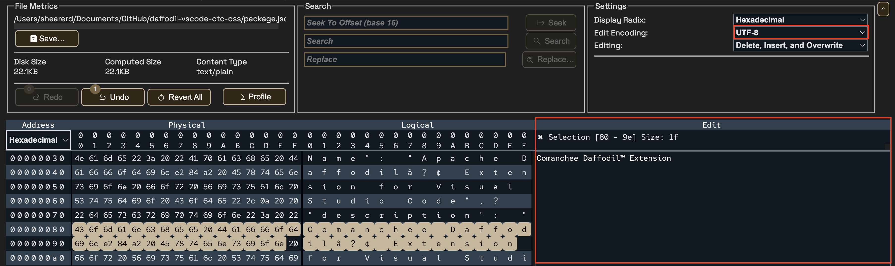

Now changes are made in the selected `Edit Encoding`.

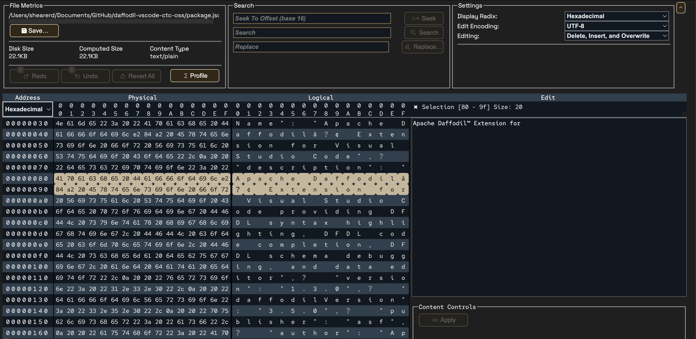

When valid changes have been made to the segment of bytes in the `Edit` viewport, the `Apply` button will become enabled.

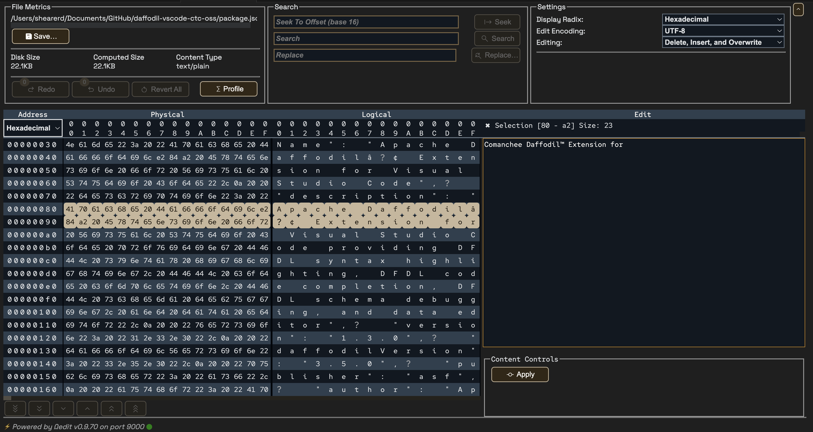

Once editing of the selected segment is completed and is valid, the `Apply` button is pressed, and the edited segment replaces the selected segment.  As with changes made in `Single Byte Mode`, changes in `Multiple Byte Edit Mode` are also applied as edit transactions that can be undone and redone.

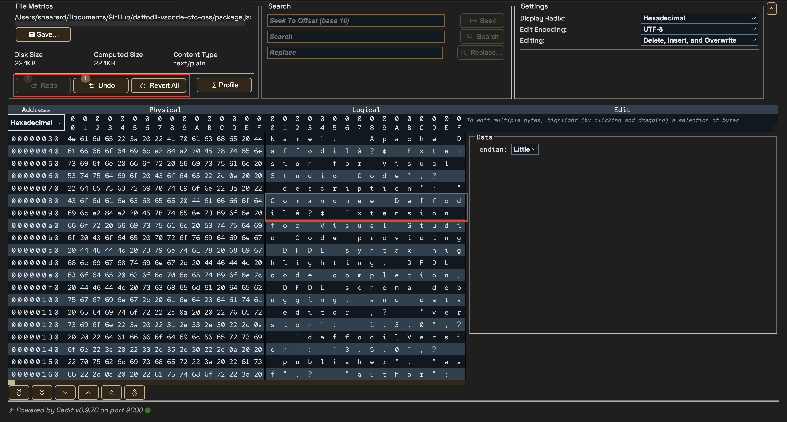

Byte addresses can be expressed in *hexadecimal*, *decimal*, or *octal*.  The selected `Address Radix` is also what is used entering an offset into the `Offset` input and for offsets and length in the `Data Profiler`. If an offset is entered in the `Offset` input and the `Address Radix` is changed, the offset will automatically be converted into the selected radix.

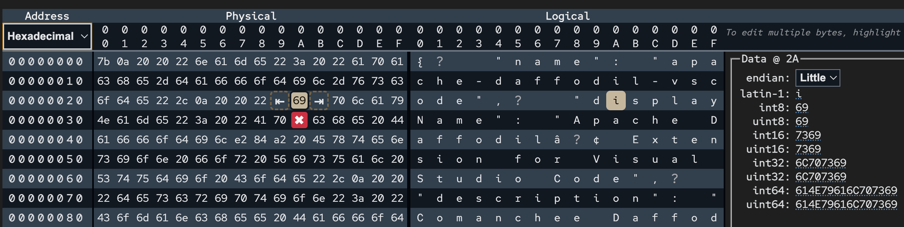
<br/>
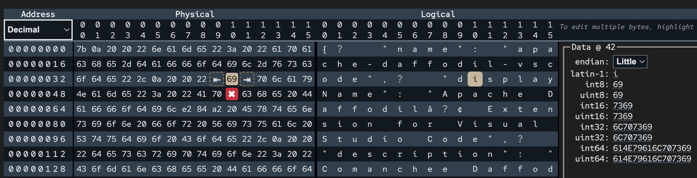

The Data Editor supports light and dark modes.  The mode is determined by the VSCode theme.  If the VSCode theme is set to a light theme, the Data Editor will be in light mode.  If the VSCode theme is set to a dark theme, the Data Editor will be in dark mode.

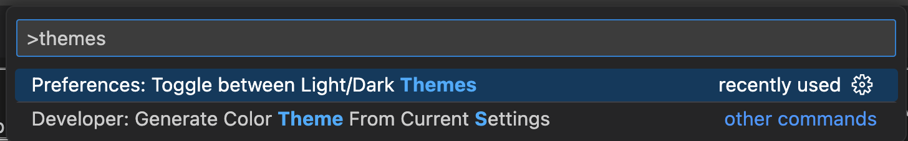
<br/>
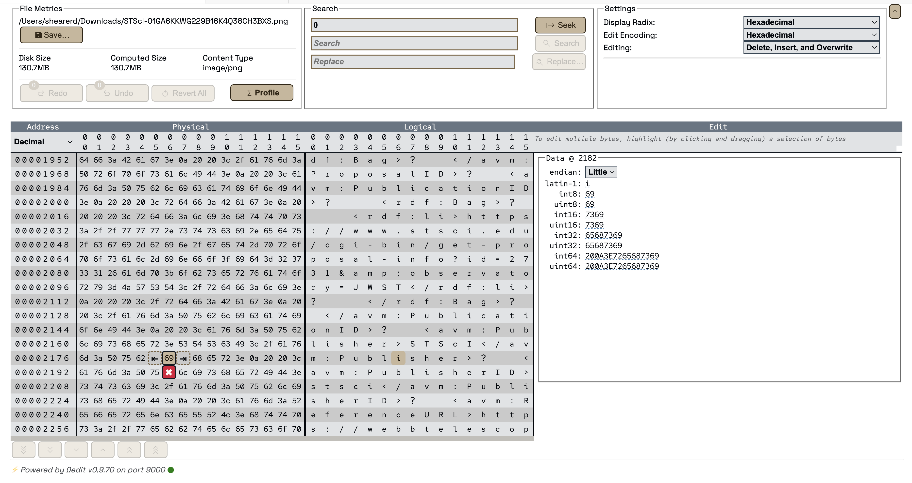

## Navigation

The Data Editor can be navigated using the mouse or keyboard.

Clicking on the `File Progress Indicator Bar` will navigate to the position in the file that corresponds to the position clicked.

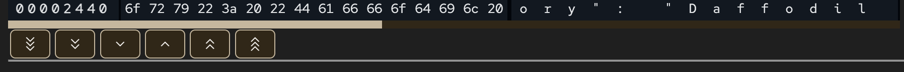

Below the `File Progress Indicator Bar` are a series of buttons that allow for navigating the file.  The `Home` button will take you to the beginning, the `Page Up` button will take you to the previous page, the `Page Down` button will take you to the next page, and the `End` button will take you to the end. The `Line Up` button will take you to the previous line, and the `Line Down` button will take you to the next line.

## Keyboard Shortcuts

The following keyboard shortcuts are available in the Data Editor:

For any input box, including the input box for `Single Byte Editing Mode`, `ENTER` will submit the input, and `ESC` will cancel the input.

When using `Single Byte Editing Mode`, `CTRL-ENTER` will insert a byte to the left of the selected byte, `SHIFT-ENTER` will insert a byte to the right of the selected byte, and `DELETE` will delete the selected byte.

When browsing the data in the `Physical` or `Logical` viewports, `Home` will take you to the top of the edited file, `End` will take you to the end of the edited file, `Page-Up` will give you the previous page of the edited file, `Page-Down` will give you the next page of the edited file, `Arrow-Up` will give you the previous line of the edited file, and `Arrow-Down` will give you the next line of the edited file. 

# Known Issues in v1.4.1

## General Issues
* Some nightly tests are still failing intermittently due to GitHub runners. 
* TDML Copy, Execute, and Append Functionality is currently not working on the MacOS Platform 

## Debugger Issues Originating from 1.4.0

* At this time the debugger step into and step out actions have no code behind them, using either button results in an unrecoverable error. We have not found a way to disable the step into and step out buttons. This problem occurs in all Operating Systems. This is [noted as a GitHub Issue](https://github.com/apache/daffodil-vscode/issues/5).

# Reporting Problems and Requesting New Features

If problems are encountered or new features are desired, create [a GitHub Issue](https://github.com/apache/daffodil-vscode/issues) and label the issue as appropriate. Be sure to include as much information as possible for us to fully understand the problem and/or suggestion. 

# Getting Help

If additional help or guidance on using Daffodil and its tooling is needed, please engage with the community on [mailing lists](https://daffodil.apache.org/community/) and/or review the [archives](https://lists.apache.org/list.html?users@daffodil.apache.org).

# Contributing

If you would like to contribute to the project, please look at [Development.md](https://github.com/apache/daffodil-vscode/blob/main/DEVELOPMENT.md) for instructions on how to get started.

# Additional Resources

* [Apache Daffodil™ Extension for Visual Studio Code Wiki](https://github.com/apache/daffodil-vscode/wiki)
* [Apache Daffodil Repository](https://github.com/apache/daffodil)

---
